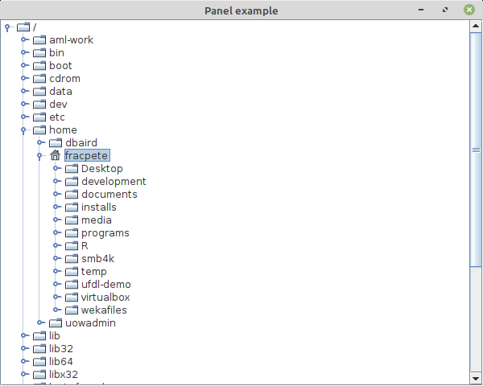
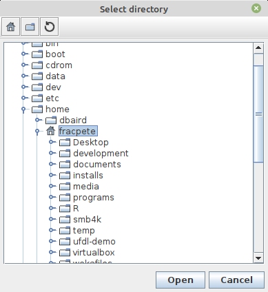
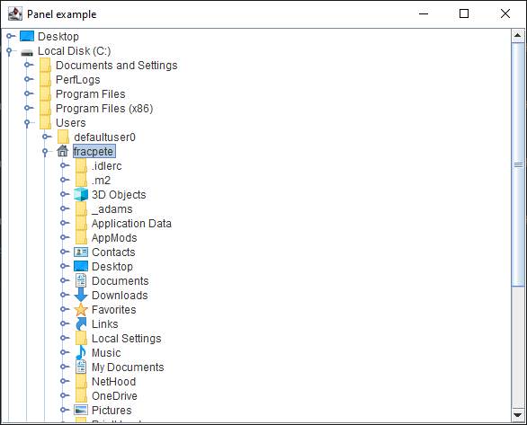
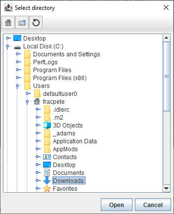

# simple-directory-chooser
Simple Java swing widgets for selecting directories, more intuitive than using the JFileChooser dialog.

## Widgets

* `nz.ac.waikato.cms.adams.simpledirectorychooser.SimpleDirectoryChooserPanel` - panel that displays the 
  directory structure.
* `nz.ac.waikato.cms.adams.simpledirectorychooser.SimpleDirectoryChooser` - `javax.swing.JFileChooser`-like 
  dialog with very similar interface to make it easier to replace 


## Maven

Use the following dependency in your `pom.xml`:

```xml
    <dependency>
      <groupId>nz.ac.waikato.cms.adams</groupId>
      <artifactId>simple-directory-chooser</artifactId>
      <version>0.0.1</version>
    </dependency>
```

## Examples

The following classes demonstrate the use of the widgets:

* [PanelExample.java](src/main/java/nz/ac/waikato/cms/adams/simpledirectorychooser/examples/PanelExample.java)
* [SimpleDirectoryChooserExample.java](src/main/java/nz/ac/waikato/cms/adams/simpledirectorychooser/examples/SimpleDirectoryChooserExample.java)


## Screenshots

### Linux

* Panel

  


* Dialog

  


### Windows

* Panel

  


* Dialog

  
